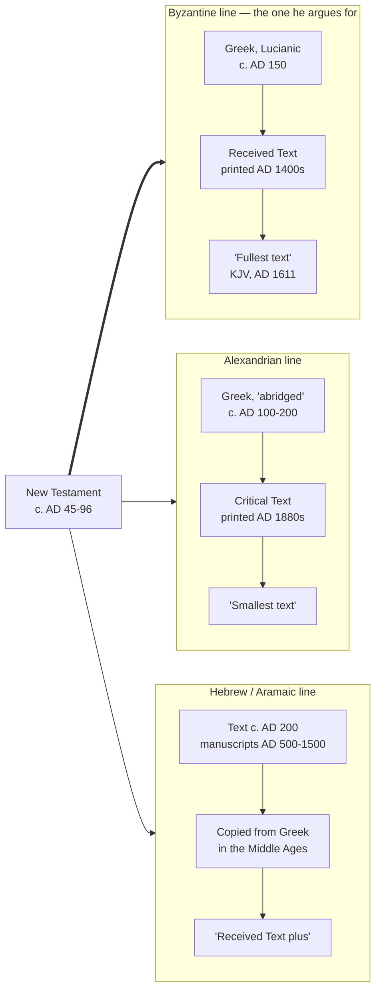
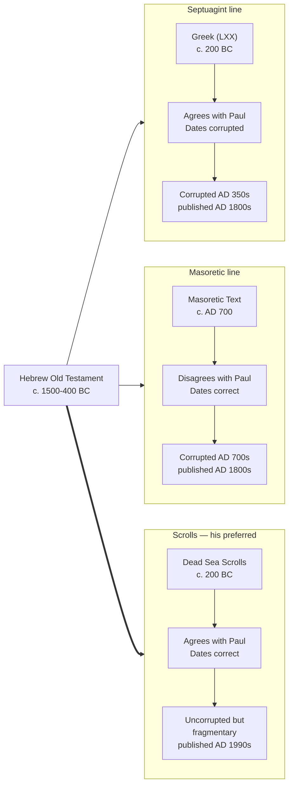

# Bible Translations & Source Texts

Every quotation in a study rests on two choices most readers never see: which *translation* rendered the verse into English, and which underlying Hebrew or Greek *edition* that translation was made from. Neither choice is neutral — a formally literal translation of an eclectic critical Greek text argues differently than a thought-for-thought translation of the Byzantine tradition, even quoting the "same" verse. This page catalogs what we actually lean on, the tradeoffs of each, and — since this repo also functions as a small research tool — which of these are wired into our own queryable database (`references/build/bible-text.db`) versus cited from general knowledge because the license doesn't allow us to store the text locally.

!!! note "Tracking key"
    - ✅ **Queryable now** — full text loaded in `bible-text.db`, openly licensed, quote at length
    - 🟡 **Queryable, restricted** — loaded, but non-commercial-only licensing (fine for this site; would need re-review if it ever monetized)
    - 🔒 **Queryable for verification, not bulk use** — verse text loaded in the external, quotation-only `study-notes.db` (not `bible-text.db`), as a byproduct of a commercial study Bible built from that same commercially copyrighted translation. Good for checking a quotation against source instead of trusting memory; not a licence to bulk-cite or concordance-search it the way a ✅ text can be.
    - ❌ **Not tracked anywhere** — commercially copyrighted, and not present in either database; cited from general knowledge with attribution, never bulk-quoted

    See [references/README.md](https://github.com/ding0t/bible_studies/blob/main/references/README.md) and [Public Data Sources](../resources/public-data-sources.md) for the full engineering-level catalog this table summarizes, and [Our Data Sources](../about/about-our-datasets.md) for the plain-language, all-sources overview this page's translation-and-source-text slice fits into.

## Translation philosophy

Our default is the **ESV** for prose quotation, cross-checked against **NASB**, **NIV**, and **NLT** for how differently-weighted translation philosophies render a disputed or ambiguous verse, against the **LSB** where the divine name is at stake (it prints Yahweh where the others print LORD), and against **WEB**, **ASV**, and **YLT** when we need a text we can actually store, search, and quote in full without a permissions ceiling. The Masoretic Text and Septuagint anchor original-language word studies; the Greek New Testament entries below anchor NT word studies and textual-criticism notes. See [AGENTS.md](https://github.com/ding0t/bible_studies/blob/main/AGENTS.md) for the standing rule this page expands on.

## Three questions to ask of any text on this page

"Hebrew text" and "Greek text" are not one category each. They cover things that differ in ways that
decide what a citation can carry, and grouping by language alone hides it — this page grouped two
19th-century translations under *Hebrew Old Testament* for a long time on exactly that mistake.

Three questions separate them.

**1. Is it in the language it was composed in?** A text can be in Hebrew without being a Hebrew
witness. Delitzsch's New Testament is Hebrew and was translated out of Greek in 1877; it witnesses a
translator, not an original. The Septuagint is the converse case — Greek, and a *translation* of
Hebrew, but made before Christ, so it witnesses a Hebrew text older than any Hebrew manuscript we
hold.

**2. What kind of edition is it?** This is the "compilation" question, and the answers are not
equivalent:

| Kind | What it means | Example |
|---|---|---|
| Manuscript | An actual surviving copy | The Dead Sea Scrolls |
| Diplomatic edition | One manuscript, printed as it stands | The Westminster Leningrad Codex |
| Eclectic edition | Compiled by choosing among many witnesses | SBLGNT, NA28, the Textus Receptus |
| Derived text | Produced from other editions by a stated procedure | UGNT, following the Bunning Heuristic Prototype |
| Translation | Rendered into another language | The Septuagint, Delitzsch, every English version |

A diplomatic edition tells you what one scribe wrote. An eclectic edition tells you what its editors
judged. Neither is "the original", and they fail in opposite directions: the first inherits one
copyist's mistakes, the second exists in no manuscript at all.

**3. What was it compiled from, and did translation happen anywhere in that chain?** Every step away
from the autograph is either an *editorial* remove (someone chose between witnesses) or a
*linguistic* one (someone rendered it into another language). Brenton's Septuagint carries both
twice over: an ancient translation out of Hebrew, an edition of that translation's manuscripts, and
Brenton's own English rendering beside it. A word study working from the English is four removes
out, and should know it.

None of this makes a text unusable. It decides what it is evidence *of*.

## English translations

| Translation | First published | Approach | Strengths | Cautions | Tracked here |
|---|---|---|---|---|---|
| **ESV** — English Standard Version (Crossway) | 2001, revised 2007/2011, fixed as a "Permanent Text" in 2016 | Essentially literal (formal equivalence), descended from the RSV | Our default citation text — literal enough for close reading, extensive textual footnotes, wide adoption across the study-Bible literature we cite in References sections; the 2016 text freeze means citations won't drift out from under us | RSV lineage carried forward a handful of textual choices scholars still debate (e.g. Isaiah 7:14's footnote); some gender-language renderings read inconsistently across books | 🔒 `esv-study-bible` in `study-notes.db` — always verify a quotation here rather than from memory |
| **NASB** — New American Standard Bible (Lockman Foundation) | NT 1963, full Bible 1971, revised 1995, updated 2020 | Maximally literal formal equivalence | The translation to reach for when word order or grammatical structure in the original matters to the argument; 2020 update modernized archaic pronouns while keeping the literalism | Literalness produces wooden prose in places; supplied-word italics clutter reading aloud; less used in general congregational settings than ESV/NIV; **no stated verse-quotation threshold** in Lockman's own permission notice, unlike every other translation on this page — don't assume a safe-harbor allowance the way ESV/NIV/NLT below have one | 🔒 `nasb-1995` / `nasb-2020` in `study-notes.db` — verify-only, see the caution above before quoting |
| **LSB** — Legacy Standard Bible (The Lockman Foundation / Three Sixteen Publishing) | 2021 | Formal equivalence — a direct revision of the NASB 1995, by scholars from The Master's Seminary | Renders the divine name as **Yahweh** throughout the Old Testament rather than "LORD" — the reason to reach for it whenever a study turns on the covenant name, since no other translation here keeps that distinction visible; translates *doulos* consistently as "slave" across the NT rather than alternating with "servant"; keeps original units and currency in the text with conversions moved to the notes; labels Hebrew acrostics with their letters | Very new, so almost no commentary or study-Bible ecosystem has grown around it yet; "Yahweh" is a minority rendering that reads as unfamiliar and usually needs a word of explanation when quoted to a general audience; it deliberately keeps "Lord" for *Kurios* in the NT even where the NT quotes a Yahweh passage, which is a considered choice but an easy one to misread as inconsistency; **the strictest quotation cap of any translation on this page** — 1,000 verses and no more than 50% of the quoting work, and Lockman's wording reaches *storage*, not only quotation | 🔒 `lsb-2021` in `study-notes.db` — verify-only; see the cap above before quoting |
| **NIV** — New International Version (Biblica/Zondervan) | NT 1973, full Bible 1978, revised 1984, major revision 2011 | Dynamic ("optimal") equivalence balancing accuracy and readability | The most widely read English Bible for decades — useful for gauging how a mainstream reader will have already encountered a verse; strong for preaching and general reading | The 2011 gender-language choices remain contested in some circles; idiomatic smoothing occasionally erases an ambiguity a literal translation preserves; the 1984 and 2011 editions differ enough that older citations may not match current printings | 🔒 `niv-cultural-backgrounds-study-bible` / `niv-biblical-theology-study-bible` in `study-notes.db` |
| **NLT** — New Living Translation (Tyndale House) | 1996, revised 2004, 2007, 2015 | Thought-for-thought, translated (not paraphrased) by committee | Excellent narrative flow, especially in Wisdom/poetic books; strong for teaching newer believers | Greater interpretive distance from the original wording than ESV/NASB; not suited to precise word-study argumentation; can smooth over a textual tension a study should actually sit with | 🔒 `nlt-life-application-study-bible` / `nlt-christian-basics-bible` in `study-notes.db` |
| **WEB** — World English Bible | Begun 1994, released 2000, ongoing light revision | Modernized, public-domain descendant of the ASV | No permissions ceiling at all — freely quotable and redistributable in full, which is why this is our default fully-queryable text when we need one; actively revised for readability while keeping an ASV-like literal backbone | Far less recognized in broader church life than ESV/NIV/NASB; no study-Bible ecosystem built around it; ongoing volunteer revision means small wording drift over time rather than a fixed edition | ✅ `ebible-eng-web` |
| **ASV** — American Standard Version | 1901 | Formal equivalence | Historically significant — the root of NASB, WEB, and (indirectly) RSV/ESV; public domain; useful for seeing exactly where later translations diverged and why | Dated, archaic English; renders the divine name as "Jehovah" throughout, which reads oddly today; superseded by its own descendants for regular study use | ✅ `scrollmapper-ASV` |
| **YLT** — Young's Literal Translation | 1862, revised 1887 and 1898 | Extremely literal, word-order-preserving | Useful for seeing Hebrew/Greek grammar and tense underneath the English that smoother translations normalize away; public domain | Famously unnatural English prose — a cross-check tool, never a primary study or reading text | ✅ `scrollmapper-YLT` |

!!! note "Also on hand for comparison"
    `bible-text.db` also carries **JPS** (Jewish Publication Society OT, useful for a Jewish-tradition reading alongside the Christian translations above), **BSB** (Berean Standard Bible, CC0, modern and readable), **Darby**, **Douay-Rheims**, and about two dozen other public-domain English editions via the Scrollmapper fork. None of these carry the weight ESV/NASB/NIV/NLT/WEB/ASV/YLT do in our actual studies, but they're there — see [Public Data Sources](../resources/public-data-sources.md) for the full list.

## What the philosophies actually do: two worked examples

The table above describes translation philosophies in the abstract. Here is what they do to two
verses this site's own studies rest on. Both were checked against the databases described below
rather than recalled, and every rendering quoted is a fragment of a single verse.

### Old Testament — Song of Songs 8:6, and whether God is named

The verse ends with four Hebrew words: אֵשׁ (*esh*, "fire"),
שַׁלְהֶבֶת (*shalhevet*, "flame", Strong's H7957), and
יָה (*Yah*, H3050) — the shortened form of the divine name. The question is
whether that last syllable names God or works as a Hebrew superlative, the way "mountains of God"
can mean "mighty mountains". The Song never mentions God anywhere else, so the decision determines
whether the book names him once or not at all.

Translations split, and the split is invisible unless you line them up:

| Reads it as the divine name | Reads it as an intensifier |
|---|---|
| ESV — "the very flame of the LORD" | NKJV — "A most vehement flame" |
| NASB 1995 — "The very flame of the LORD" | NIV — "like a mighty flame" |
| **LSB — "The very flame of Yah"** | NLT — "the brightest kind of flame" |
| WEB — "a very flame of Yah" | CSB — "an almighty flame" |
| ASV — "A very flame of Jehovah" | BSB — "the fiercest blaze of all" |
| YLT — "a flame of Jah!" | Geneva (1599) — "vehement flame" |
| JPS — "a very flame of HaShem" | |

A reader of the CSB and a reader of the ESV are not reading the same claim about this verse. Only the
LSB prints the name itself rather than the substitute "LORD", which is the case for keeping it on the
shelf when the covenant name is the point.

The translators knew. Three committees footnote the fork at this verse — the LSB offers "Or *A vehement flame*" and explains that *Yah* is "the shortened form of Yahweh, found in
poetry and praise (e.g. Hallelu*jah*), and in names (e.g. Zechar*iah*)"; the CSB, having printed the
intensifier, notes "Or *the blaze of the Lord*". **Reading the footnote is faster than reconstructing
the disagreement from six parallel versions, and it is the translators' own testimony that the
question is live.**

### New Testament — John 6:54, and a verb most translations flatten

Through John 6 Jesus uses the ordinary verb for eating, ἐσθίω (*esthiō*, G5315), eleven times: the
crowd ate the loaves, the fathers ate manna, "unless you eat the flesh of the Son of Man" (6:53). At
verse 54 he switches to τρώγω (*trōgō*, G5176) and stays with it for the rest of the discourse. The
lexicon separates them — Louw-Nida puts ἐσθίω at 23.1 and τρώγω at 23.3, alongside γεύομαι ("taste")
and βιβρώσκω, the chewing-and-consuming end of the range. Verse 58 uses both in one sentence: the
fathers *ate* (ἔφαγον) and died; whoever *feeds on* (τρώγων) this bread will live.

Of every translation on this page, one marks the change:

| | John 6:54 |
|---|---|
| **ESV** | "Whoever **feeds on** my flesh…" |
| NASB 1995/2020, **LSB**, NIV, NKJV, CSB, NLT, WEB, ASV, YLT, BSB | "…**eats** my flesh…" |

The ESV stands alone. Worth noticing which translations do not: the NASB and LSB are the most
formally equivalent versions here, and both flatten a distinction the ESV keeps. **A translation's
stated philosophy predicts its general behaviour, not its decision at any particular verse** — which
is the whole argument for checking a verse rather than trusting a label.

!!! note "A correction this site had to make"
    An earlier draft of one study asserted the opposite — that the ESV *obscures* John's
    ἐσθίω→τρώγω shift. It renders every occurrence "feeds on"; the claim was written from memory and
    was wrong in the exact direction that flattered the argument. It is recorded in
    [AGENTS.md](https://github.com/ding0t/bible_studies/blob/main/AGENTS.md) as the reason
    quotations here get verified against a database rather than recalled.

## Hebrew Old Testament

| Text | Date | What it is | Strengths | Cautions | Tracked here |
|---|---|---|---|---|---|
| **Masoretic Text** — Westminster Leningrad Codex (WLC) | Manuscript dated 1008 CE by its own colophon | The standard Hebrew Bible text underlying virtually every printed Hebrew Bible (BHS/BHQ) and every English OT translation above | Oldest *complete* Masoretic manuscript in existence, full vocalization/cantillation/Masoretic notes intact; our copy carries both morphological tagging (`morphhb`) and SDBH semantic-domain codes (`macula-hebrew`) — the two together are what make Hebrew word studies here queryable rather than hand-searched | A single-manuscript edition, not an eclectic reconstruction — it inherits that one codex's scribal idiosyncrasies; copied roughly 1,400 years after the events it records and centuries after the Dead Sea Scrolls, so cross-checking against those earlier witnesses still matters on disputed readings | ✅ `morphhb-wlc`, `macula-hebrew-wlc`, `scrollmapper-WLC` |
| **Dead Sea Scrolls** (biblical scrolls) | Copied c. 250 BCE – 68 CE | 262 scroll witnesses to 36 of the 39 Old Testament books, transcribed by Martin Abegg and colleagues | **A thousand years older than the Masoretic manuscripts** — the only pre-Christian Hebrew witnesses we hold. Each scroll is kept as its own work, because they disagree: Isaiah 53:5 survives in both 1Qisaa and 1Q8 and they read differently. Makes Deuteronomy 32:8 and Psalm 22:16 checkable here rather than taken on report | Fragmentary — **31.8% of words carry an editorial mark**, and our text keeps them: `[ ]` is reconstruction, `#` and `?` damaged or uncertain. A scroll reading inside brackets is an editor's judgement, not manuscript evidence. Esther is absent entirely. Non-commercial licence | 🟡 `dss-*` |
| **Samaritan Pentateuch** | Extant manuscripts from the medieval period; tradition claims earlier origins | An independent Torah-only text tradition preserved by the Samaritan community | Valuable second witness for text-critical comparison against the Masoretic Text on disputed Torah readings | Reflects Samaritan theological commitments (Mount Gerizim vs. Jerusalem, among others) rather than the mainstream Jewish transmission line — a comparison tool, not a primary text | 🟡 `scrollmapper-SP` |

!!! tip "New to lemmas, parsing and semantic domains?"

    This page is about which *text* to trust. [Reading the Original-Language
    Data](original-language-data.md) is about the annotation attached to those texts — what MACULA
    is, and what a lemma, a Strong's number, a morphology code and a semantic domain each mean, with
    Genesis 1:1 shown at every layer.

!!! note "Which English word renders which Hebrew or Greek word"

    One translation here carries something the others do not. unfoldingWord's **ULT** (`uw-ult`) is
    aligned word by word to the Hebrew and Greek, so `query.py interlinear <book> <ch> <v>` answers
    *what is this English word actually translating* — the question behind most word studies, and
    one this project previously had no way to answer without judgement.

    Two cautions. The mapping is genuinely many-to-many: Genesis 1:1's "the heavens" renders both
    אֵת and הַשָּׁמַיִם, since the Hebrew object marker has no English of its own. And ULT is one
    literal translation, so it tells you what ULT chose, not what the word must mean — for that,
    look the lemma up.

## Hebrew New Testaments — translations, not witnesses

Both are in Hebrew and neither is a Hebrew witness: they are 19th-century renderings **out of
Greek**, made long after the New Testament was written. They sat under *Hebrew Old Testament* on
this page until 2026-09-05, which is precisely the confusion the three questions above exist to
prevent.

| Text | Date | What it is | Strengths | Cautions | Tracked here |
|---|---|---|---|---|---|
| **Delitzsch Hebrew Bible** | First published 1877, revised through the early 20th century | A modern scholarly Hebrew *translation* of the New Testament, paired here with the Hebrew OT | Useful for tracing how NT vocabulary and OT allusions map back into Hebrew — helpful for spotting an OT echo a Greek-only reading might miss | Not an ancient witness — a 19th-century translation project (Franz Delitzsch), so it reflects translator choices, not manuscript history; never cite it as if it were the OT's own Hebrew | ✅ `ebible-heb` |
| **Salkinson-Ginsburg Hebrew New Testament** | Salkinson 1885, revised by Ginsburg 1886 | A second scholarly Hebrew *translation* of the New Testament, independent of Delitzsch | Read against Delitzsch it shows where a Hebrew rendering is a translator's choice rather than something the Greek forces — Romans 1:17 is *from faith to faith* in Delitzsch and *from a wellspring of faith* in Salkinson | Not an ancient witness — a 19th-century translation, and its restriction to Tanakh vocabulary is a stylistic programme, not evidence of an earlier Hebrew text | ✅ `ebible-hebsg` |

!!! note "Two Hebrew New Testaments, and what they can and cannot settle"

    Delitzsch and Salkinson-Ginsburg are independent 19th-century translations of the Greek into Hebrew, and they differ in every verse. That disagreement is the point: where they diverge, a Hebrew rendering is the translator's judgement rather than something the Greek compels. Neither is a witness to a Hebrew original, and no ancient Hebrew New Testament manuscript exists — the earliest Hebrew gospel witnesses (Shem Tov, Du Tillet, Münster) are medieval, and the Cochin manuscript Cambridge holds is an 18th-century Hebrew Matthew its own catalogue describes as made for polemical purposes.

    A live question sits alongside that. Some readings in these Hebrew editions have no counterpart in the Greek, and there is an argument that the earliest printings of Salkinson-Ginsburg carried readings later editions removed. Second Thessalonians 2:7 is the case that matters most here, since the identity of the restrainer bears on [the rapture study](../last-things/rapture.md). What our copy actually reads at that verse is recorded in `references/README.md`, dated, so the claim can be tested against a specific text instead of a recollection.

## Greek New Testament

| Text | Date | What it is | Strengths | Cautions | Tracked here |
|---|---|---|---|---|---|
| **SBLGNT** — SBL Greek New Testament | 2010, ed. Michael Holmes | The modern eclectic critical text this project queries by default | Openly licensed (CC BY 4.0), so it's the one we can actually store and quote in full; assembled by comparing several prior critical editions' agreements and disagreements; carries per-word morphology, lemma, and Louw-Nida semantic-domain tagging in our copy (`macula-greek`) | A documented *synthesis* of existing eclectic editions rather than a fresh manuscript collation — where its source editions already agreed on a disputed reading, SBLGNT doesn't add independent new evidence | ✅ `sblgnt`, `macula-greek-sblgnt` |
| **NA28** — Nestle-Aland, 28th edition | 2012 | The critical text nearly all modern scholarship and translations (ESV, NIV, NASB, etc.) actually cite | The field standard; the most recent edition incorporated fresh collation of the Catholic Epistles against the full manuscript tradition (the ECM project) | Commercial license — not in our own database at all; reachable only indirectly through the NA28-ESV parallel inside the external, quotation-only `study-notes.db`, never quoted at length | ❌ Not tracked; quotation-only via `study-notes.db` |
| **Tischendorf, 8th edition** | 1869–1872 | Constantin von Tischendorf's critical text, built heavily on Codex Sinaiticus — which Tischendorf himself discovered at St. Catherine's Monastery | An independent line of 19th-century critical-text reasoning, distinct from the SBLGNT/NA28 editorial lineage; public domain | Over 150 years old — predates the papyri discoveries and collation work that inform NA28/SBLGNT | ✅ `ebible-grc-tisch` |
| **Byzantine/Majority Text** (Robinson-Pierpont) | 2005, revised 2013 | The Byzantine manuscript tradition underlying the KJV/Textus Receptus lineage — the majority reading by raw manuscript count | Valuable for seeing exactly where the eclectic critical texts diverge from the Majority Text, and why | "Majority by count" is a different argument than "earliest or best attested" — worth being explicit about that distinction whenever citing it | 🟡 `scrollmapper-Byz` |
| **UGNT** — unfoldingWord Greek New Testament | 2022– | The Greek text unfoldingWord's translations are aligned to, following the *Bunning Heuristic Prototype* | Openly licensed (CC BY-SA 4.0) and queryable here; a fourth lineage alongside SBLGNT, Tischendorf and the Byzantine text, and the text that makes ULT's word-level alignment resolvable | **A different kind of edition** — a heuristic text from the Center for New Testament Restoration rather than a committee edition like NA28. It differs from SBLGNT in roughly one verse in six: at John 1:34 it reads Υἱὸς where SBLGNT has ἐκλεκτός. Check which text a reading comes from before resting an argument on it | ✅ `uw-ugnt` |
| **Textus Receptus** (Stephanus 1550 / Scrivener 1894) | 1550, standardized 1894 | The specific printed Greek text underlying the King James Version | Essential for explaining *why* the KJV reads differently from modern translations at a given verse (e.g. the Comma Johanneum at 1 John 5:7-8) | Based on a small number of late medieval manuscripts available to Erasmus in the 1500s, long since superseded by far older manuscript evidence | 🟡 `scrollmapper-TR` |

### Three lines of transmission, as Ken Johnson frames them

The table above is a catalogue: it says what each text is, but not how they relate to one another.
Ken Johnson (Bible Facts) maps that relation as three lines descending from the original, in a study
introducing his verse-by-verse work on the Hebrew Thessalonians
([video](https://www.youtube.com/live/AN8EWx822pM)). It is redrawn here with his own spoken dates,
because the shape is a useful map of the disagreement even where his argument is contested — and
because a reader meeting "Textus Receptus" and "critical text" in the table deserves to know they
are the endpoints of a live dispute rather than two neutral options.

**His argument.** The Received Text is the fullest, and the critical text is that text with material
removed. The third line runs through Hebrew and Aramaic manuscripts: most of it is medieval
back-translation from Greek, which he concedes freely, but a subset carries readings that
back-translation does not explain — some of them *anti*-Catholic, which would have made an
inquisition worse rather than deflected one, appearing at the same places across independent
manuscript families, and quoted by church fathers who predate every surviving manuscript. Hence
"Received Text **plus**" rather than a fourth text-type. That last argument is the strongest part of
his case: it is a genuine falsification of the usual explanation for those particular readings,
rather than an appeal to preference.

**Where it is contested, and this site does not follow him.** *"The critical text is the Received
Text with material cut out"* is the disputed question stated as a premise. The mainstream reading
runs the other way — that the Byzantine text is the later and fuller one — and neither direction can
be assumed from the diagram. His attribution of the first line to Lucian also conflates two things:
Lucian of Antioch died in 312, not the mid-second century, and the "Lucianic recension" is a
proposal about text-type whose attribution is itself debated, not an account of who assembled the
canon.

**What he explicitly does not claim.** Not Hebrew primacy — *"we don't want to argue that the Greek
or the Hebrew or the Aramaic is the original."* He suggests Matthew and Paul may have written in
more than one language, and warns against the fallacy in both directions: a shorter text is not
automatically earlier, and a longer one is not either. The third line above bears on
[the two Hebrew New Testaments](#hebrew-old-testament) this repo actually holds, where the same
caution applies.

## Septuagint (Greek Old Testament)

| Text | Date | What it is | Strengths | Cautions | Tracked here |
|---|---|---|---|---|---|
| **Brenton Septuagint** | Greek text and English translation published 1844/1851 (Sir Lancelot C. L. Brenton) | The standard public-domain LXX edition, Greek text based on Codex Vaticanus | Essential for tracing how New Testament authors quote the Old Testament — many NT quotations follow the LXX's wording rather than the Masoretic Text's; openly licensed and fully queryable here | Vaticanus-based text is one witness among several LXX manuscript traditions (Alexandrinus and Sinaiticus each diverge in places); the accompanying English prose is 19th-century and reads as dated. Its Daniel is **Theodotion**, not the Old Greek — identifiable at Daniel 1:3, which reads Ἀσφανὲζ where the Old Greek has Ἀβιεσδρί — so say which Greek Daniel you mean when citing it | ✅ `ebible-grcbrent` |

!!! warning "The LXX numbers its chapters differently — check before comparing"

    A reference is not a universal address. The Septuagint renumbers nearly the whole psalter, so English Psalm 23 is **LXX Psalm 22**, and it adds a Psalm 151. Jeremiah is reordered rather than renumbered — the oracles against the nations move to the middle of the book, so the new covenant passage Hebrews 8 quotes is English Jeremiah 31 but **LXX Jeremiah 38** — and because the chapter *count* is identical at 52, nothing about the book looks unusual until a citation lands in the wrong place. Joel and Malachi divide as the Hebrew does rather than as English Bibles do, and Daniel divides differently again at each end: the Septuagint follows the English break at 3/4 and the Hebrew one at 5/6.

    The repo resolves this rather than leaving it to memory. Every work in `bible-text.db` records which scheme it uses, and `uv run python query.py align Joel 2 28` reports a reference as each scheme numbers it. Verse lookups align automatically; see [references/README.md](https://github.com/ding0t/bible_studies/blob/main/references/README.md) for the cases that are deliberately left unmapped because no correspondence can be established.

!!! note "Why isn't the Septuagint's *text* alongside its lemma tooling?"
    `GreekResources` (our lemma/lookup fork for LXX word studies) deliberately ships without the LXX text itself — its own maintainers exclude it because the standard CATSS source is restrictively licensed, and we followed that same discipline rather than bundling in a text we couldn't verify the rights to. Brenton's edition above fills that gap with a text we've independently confirmed is public domain.

### Three Old Testament lines, as Ken Johnson frames them

The companion to [the New Testament diagram above](#three-lines-of-transmission-as-ken-johnson-frames-them),
from the same study. Three witnesses descend from the Hebrew, and he grades each on two axes: whether
it agrees with the New Testament's quotations, and whether its genealogical numbers are sound.

**His argument.** The Masoretic Text is a thousand years younger than the scrolls and was copied by
scribes with a motive to smooth over messianic readings, so where a New Testament writer quotes the
Old and the Masoretic disagrees, the scrolls side with the New Testament writer. The Septuagint
agrees with the New Testament but carries inflated genealogical numbers. The scrolls alone score on
both axes. (His slide dates the Masoretic line "~700 BC"; his spoken date is AD 700, which is the
one to read.)

**What checks out here.** The genealogical divergence is real and queryable in this repo: at Genesis
5:3 Brenton's Septuagint reads *τριάκοντα καὶ διακόσια* — 230 years to Seth's birth — where the
Hebrew reads 130. [Genealogy and the Age of the Earth](../last-things/genealogy-times.md) tables all
three traditions generation by generation. And on the one verse of Genesis 5 the scrolls actually
preserve, his dates column holds: 4Q2 at Genesis 5:13 reads *eight hundred and forty*, siding with
the Masoretic against the Septuagint's 740.

**Where the diagram is tidier than the evidence.** That last check is also the problem with it. The
biblical scrolls preserve **one verse of Genesis 5 and none of Genesis 11** — so whatever recommends
their chronology, it is not their coverage of the genealogies, and a verdict of "dates correct"
rests on a single fragmentary line. "Uncorrupted" needs the same caution the Dead Sea Scrolls row
above records: 31.8% of words in this corpus carry an editorial mark, and a bracketed reading is a
modern editor's reconstruction.

The "agrees with Paul" axis has also now been enumerated rather than estimated. Of the 140 strong
New Testament quotations of the Old that this repo derives, **eighteen land on a verse where a
scroll also differs from the Masoretic — and read one at a time, one of them is a case where the
scroll supplies the reading the New Testament follows.** That one is Isaiah 61:1, where 1QIsaa
carries the single divine name Luke 4:18 and the Septuagint have, against the Masoretic's double —
and even there 4Q56 and 4Q66 keep the Masoretic reading. Two of the most quoted verses run the other
way outright: at Isaiah 53:1 the *"Lord"* that John 12:38 opens with is a Septuagint plus that all
three scrolls lack, and at Isaiah 7:14 the scroll reads *he shall call* where the Masoretic has *she
shall call* and Matthew has *they shall call* — the scroll differs from the Masoretic, but not in
Matthew's direction.

The deeper issue is that the two axes do not partition together. At Deuteronomy 32:8 the scroll
reads *sons of God* against the Masoretic *sons of Israel*, siding with the New Testament; at
Genesis 5:13 the same corpus sides with the Masoretic on a number. Qumran is textually plural —
some scrolls are proto-Masoretic, some stand behind the Septuagint, some are independent — and that
plurality is the discovery rather than a fault in one column. Two further details resist the tidy
split: AD 700 is when the Masoretes added vowel points, not when their consonantal text began, since
that text is attested at Qumran centuries earlier; and his own headline case, Hebrews 10:5, is
explained by the Septuagint alone with no scroll required.

## Why the "main" translations aren't in `bible-text.db`

It's not an oversight that ESV, NASB, NIV, and NLT — the four translations we quote most in prose — are missing from `bible-text.db`, the ✅ database. They're commercially copyrighted, and Crossway/Lockman/Biblica/Tyndale's permissions policies allow generous quotation (a study citing a verse or a short passage with attribution is exactly the intended use) but not bulk redistribution into a database anyone could dump wholesale. WEB, ASV, and YLT exist in our own database specifically so we always have *something* fully open to fall back on — for concordance searches, cross-reference generation, or any use that would otherwise require copying a commercial text at scale.

All four get the same narrower exception, marked 🔒 above rather than ❌: each one's verse text is a byproduct of a commercial study Bible (or, for NASB, a standalone edition) loaded into `study-notes.db` — `esv-study-bible`; `niv-cultural-backgrounds-study-bible` / `niv-biblical-theology-study-bible`; `nlt-life-application-study-bible` / `nlt-christian-basics-bible`; `nasb-1995` / `nasb-2020` — so each is queryable there for the one purpose that license permits: checking a quotation against source before publishing it, not bulk concordance work.

NASB is the one to treat more cautiously even within that 🔒 tier. ESV, NIV, and NLT all carry a stated safe-harbor (500–1,000 verses / 25–50% of a work, see the permissions table in [references/README.md](https://github.com/ding0t/bible_studies/blob/main/references/README.md)) — quote a verse or two in a study and you're comfortably inside it. NASB's own permission notice states no such threshold at all; Lockman's language requires quotation and reprint requests to be "directed to and approved in writing." Being 🔒-tracked here means an NASB quotation can be *verified* against source instead of trusted from memory — it doesn't mean the safe-harbor reasoning that applies to the other three translations extends to NASB.

Reach for the 🔒 translations when writing for a reader (verify against `study-notes.db` first, and for NASB specifically don't lean on a verse-count safe harbor that doesn't exist); reach for the ✅ ones when writing a query.
