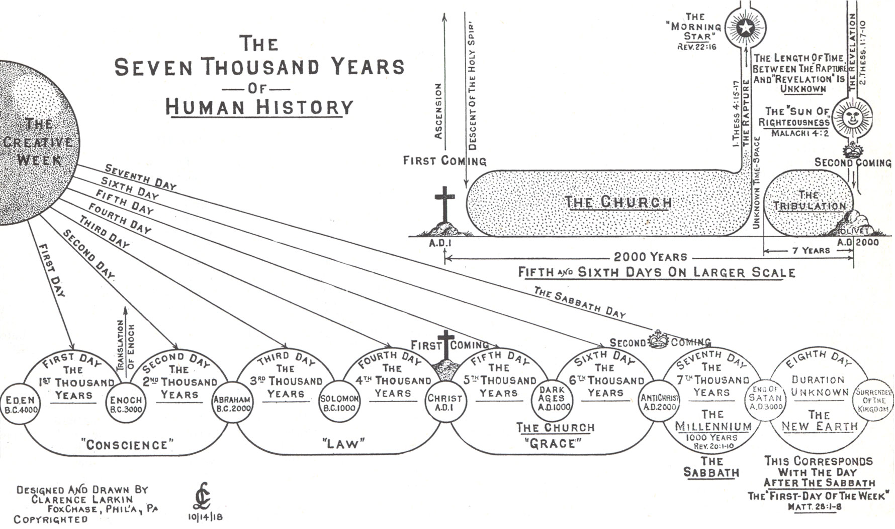

# Bible Prophecy Essentials

## Objective

To provide a foundation for understanding the Bible in the context of prophecy.

## Why study Bible prophecy

- 70% of the Bible is prophecy
- To know our future hope -- and encourage one another with it
- A faith builder -- that you may believe that Jesus is the Christ
- To be like the Bereans, testing everything against Scripture
- So you are not deceived by the lies of the world, and not snatched away

## Background

- Moses: Genesis to Deuteronomy lays the foundation

## Approach to understanding prophecy

- Types: events and festivals point to a greater truth
- Literal interpretation first
- The test of a true prophecy: 100% fulfillment, not partial

## Context: Jesus is the key

Jesus is the primary context for all prophecy. Read even the Psalms in light of Christ -- some 300 prophecies are directly fulfilled by Him.

> ✝️ [Luk 24:27 (ESV)](https://www.blueletterbible.org/esv/Luk/24/27)
>
> And beginning with Moses and all the Prophets, he interpreted to them in all the Scriptures the things concerning himself.

Without the Hebrew background behind the text, we miss much of this.

## Hebrew background: the 6000-year framework

- 6000 years are expected before the second coming of the Messiah -- see the [Zadok calendar](zadok-calendar.md) for how this site dates that framework
- The literal six days of creation are a type of this
- Do not be fooled by the father of lies
- An old-earth timescale of millions of years is a lie told to explain life without our Creator

## Essential prophecy

Essential if it is referred to, or expected to be known, in the New Testament:

- Genesis: the crushing of the serpent's head, the six days of creation
- Daniel's seventy weeks, which frames the tribulation
- Ezekiel: the future war and restoration of Israel
- Jesus' Olivet Discourse, which frames the future
- 1 Corinthians: what will happen to our bodies
- 1 Thessalonians: the rapture
- Revelation: the tribulation

## Major themes of prophecy

- Messiah
- Salvation to the faithful
- Israel
- Judgment
- Eternal life

## Times

- Prophecy fulfilled
- Prophecy being fulfilled
- Prophecy yet to come

## References

- [Larkin charts](https://www.blueletterbible.org/images/larkin/)
