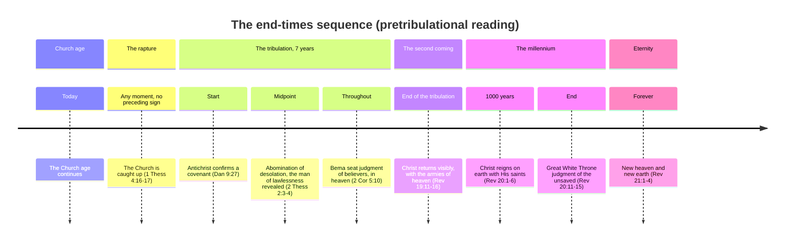
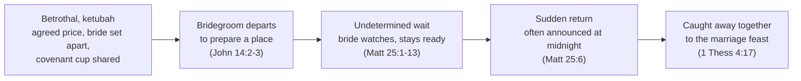

# The rapture of the Church

Studies on end times, and specifically on the *blessed hope* — the Church's expectation of being gathered to Christ before the world's final judgment falls.

There are two well-argued perspectives on how this happens. The first holds that the rapture — the *harpazo*, "catching up" — is a distinct event from the second coming of Christ, separated by the seven-year tribulation. The second holds that the *harpazo* and the second coming are the same event, described in different terms. What follows makes the case for the first view — pretribulational and dispensational, consistent with how this site reads prophecy elsewhere (see [The Zadok Calendar](zadok-calendar.md) and [The Day is Near](day-is-near.md)) — while giving the second a fair hearing under [Other end-times views](#other-end-times-views).

Whichever view is correct, the core promise doesn't change: Christ is coming for His Church, and that hope is meant to comfort, not to divide.

## Summary of findings

- The Greek word behind "rapture," ἁρπάζω (*harpazo*), consistently describes a sudden, forcible removal from one place to another — every other time the New Testament uses it of a person being taken to heaven, it's a real, physical, momentary event, not a metaphor.
- The rapture is presented as imminent — no signs are given for it to wait on, unlike the second coming, which is preceded by specific, named events (Daniel 9:27, Matthew 24).
- The tribulation is a specific seven-year period (Daniel's seventieth week) during which God's wrath is poured out on a Christ-rejecting world — Scripture says believers are not destined for this wrath (1 Thessalonians 5:9) and promises the church in Philadelphia will be kept *from* the hour of trial, not merely *through* it (Revelation 3:10).
- Believers face a separate judgment from unbelievers — the Bema seat, a judgment of reward for the saved (2 Corinthians 5:10; 1 Corinthians 3:11-15), not the Great White Throne judgment of the unsaved dead (Revelation 20:11-15).
- The whole sequence — rapture, tribulation, second coming, millennium, eternity — fits the pattern of an ancient Jewish wedding remarkably closely, which is very likely not a coincidence given who Jesus was speaking to.

## Approach

1. Review the relevant literature.
2. Record the biblical texts directly, rather than working from summaries of them.
3. Order the texts into a coherent sequence of events.
4. Note anything that doesn't fit cleanly, rather than smoothing it over.
5. Use more than one presentation format — texts, tables, and diagrams — since a sequence of events is often clearer to see than to read.

## The word behind "rapture": ἁρπάζω

The English word "rapture" doesn't translate anything directly — it comes from the Latin Vulgate's *rapiemur* ("we will be caught up"), itself a translation of the Greek verb actually used in [1 Thessalonians 4:17 (ESV)](https://www.blueletterbible.org/esv/1Th/4/17): **ἁρπάζω** (*harpazō*, pronounced har-PAD-zo, Strong's G726), "to seize, snatch, or catch away by force."

**Where the word comes from.** In classical and koine Greek generally, ἁρπάζω is ordinary language for forcible seizure — a wolf snatching prey, a robber seizing goods, a kidnapper taking a person against their will. There's nothing inherently religious or gentle about the word; its core sense is *sudden, forceful removal*, and that sense carries through everywhere the New Testament uses it.

**How the New Testament actually uses it.** The word occurs 14 times. Most describe ordinary forceful seizure: a wolf snatching sheep (John 10:12), a strong man's house being plundered (Matthew 12:29), the word snatched away by the evil one before it takes root (Matthew 13:19), a mob trying to seize Paul (Acts 23:10), someone snatched from the fire (Jude 1:23). No one can *seize* the Father's sheep out of His hand (John 10:28-29) — the same force, turned into a promise of security.

But four occurrences describe something more specific: a person being suddenly, physically taken up into heaven or the heavenly realm.

- **[2 Corinthians 12:2-4 (ESV)](https://www.blueletterbible.org/esv/2Co/12/2-4)** — Paul describes himself (guardedly, in the third person) being "caught up" to the third heaven, into paradise — a real, momentary, involuntary experience, not something he did to himself.
- **[Acts 8:39 (ESV)](https://www.blueletterbible.org/esv/Act/8/39)** — after baptizing the Ethiopian eunuch, "the Spirit of the Lord carried Philip away" — an abrupt, physical relocation.
- **[Revelation 12:5 (ESV)](https://www.blueletterbible.org/esv/Rev/12/5)** — the male child (Christ) is "caught up to God and to his throne," His ascension described with the same verb.
- **[1 Thessalonians 4:17 (ESV)](https://www.blueletterbible.org/esv/1Th/4/17)** — "we who are alive, who are left, will be caught up together with them in the clouds to meet the Lord in the air."

**Conclusion.** Every time ἁρπάζω describes someone going to be with God, it describes a real, sudden, physical event — not a slow transition, and not a figure of speech for dying or for a spiritual change of status. That's the term Paul reaches for in 1 Thessalonians 4:17, deliberately, and it's the strongest lexical argument that the rapture is exactly what it sounds like: a real, sudden, bodily gathering of the Church, distinct in kind from the visible, earth-bound Second Coming described a few paragraphs later in 2 Thessalonians.

## The sequence of end-time events

## Certainty

> ✝️ [John 14:1-4 (ESV)](https://www.blueletterbible.org/esv/Joh/14/1-4)
>
> 1 "Let not your hearts be troubled. Believe in God; believe also in me. 2 In my Father's house are many rooms. If it were not so, would I have told you that I go to prepare a place for you? 3 And if I go and prepare a place for you, **I will come again and will take you to myself, that where I am you may be also.** 4 And you know the way to where I am going."

This is where Chuck Missler begins his own discussion of the "blessed hope," and for good reason — before any sequence of events is worked out, the promise itself is stated plainly: Christ is coming back *for His own*, personally, to take them to be with Him.

## The imminence of the rapture

> ✝️ [Matthew 24:36-44 (ESV)](https://www.blueletterbible.org/esv/Mat/24/36-44)
>
> 36 "But concerning that day and hour no one knows, not even the angels of heaven, nor the Son, but the Father only. 37 For as were the days of Noah, so will be the coming of the Son of Man. 38 For as in those days before the flood they were eating and drinking, marrying and giving in marriage, until the day when Noah entered the ark, 39 and they were unaware until the flood came and swept them all away, so will be the coming of the Son of Man. 40 Then two men will be in the field; one will be taken and one left. 41 Two women will be grinding at the mill; one will be taken and one left. 42 Therefore, stay awake, for you do not know on what day your Lord is coming. 43 But know this, that if the master of the house had known in what part of the night the thief was coming, he would have stayed awake and would not have let his house be broken into. 44 Therefore you also must be ready, for the Son of Man is coming at an hour you do not expect."

- No sign is given here for the rapture to wait on — contrast this with the specific, sequenced signs Jesus gives for the second coming earlier in the same chapter (Matthew 24:4-31). That contrast is itself an argument for two distinct comings, not one.
- The rapture is pre-judgment: Noah's household is removed *before* the flood falls, not partway through it or after.
- The ark is a type of the rapture, at least loosely — a way of escape prepared in advance, entered before judgment arrives, not during it.
- "You also must be ready" — the imminence isn't a detail to work out; it's the point of the passage.

> ✝️ [Matthew 25:1-13 (ESV)](https://www.blueletterbible.org/esv/Mat/25/1-13)
>
> 1 "Then the kingdom of heaven will be like ten virgins who took their lamps and went to meet the bridegroom. 2 Five of them were foolish, and five were wise. 3 For when the foolish took their lamps, they took no oil with them, 4 but the wise took flasks of oil with their lamps. 5 As the bridegroom was delayed, they all became drowsy and slept. 6 But at midnight there was a cry, 'Here is the bridegroom! Come out to meet him.' 7 Then all those virgins rose and trimmed their lamps. 8 And the foolish said to the wise, 'Give us some of your oil, for our lamps are going out.' 9 But the wise answered, saying, 'Since there will not be enough for us and for you, go rather to the dealers and buy for yourselves.' 10 And while they were going to buy, the bridegroom came, and those who were ready went in with him to the marriage feast, and the door was shut. 11 Afterward the other virgins came also, saying, 'Lord, lord, open to us.' 12 But he answered, 'Truly, I say to you, I do not know you.' 13 Watch therefore, for you know neither the day nor the hour."

- Why ten? Five foolish, five wise — a mixed group, outwardly identical until the moment of testing.
- The wise were prepared *in advance* for the bridegroom's return, not scrambling to prepare when he arrived.
- "They all became drowsy and slept" — worth noting the parallel with Gethsemane, where Jesus prayed and the disciples slept (Matthew 26:36-45); sleep, in both scenes, is what happens to people who don't grasp the weight of the moment.
- "Those who were ready went in with him... and the door was shut" — a door that shuts is a door that, at some point, cannot be opened again.
- "Watch therefore, for you know neither the day nor the hour" — the same imminence as Matthew 24, now tied explicitly to a wedding.

## The call to rapture

> ✝️ [1 Thessalonians 4:15-18 (ESV)](https://www.blueletterbible.org/esv/1Th/4/15-18)
>
> 15 For this we declare to you by a word from the Lord, that we who are alive, who are left until the coming of the Lord, will not precede those who have fallen asleep. 16 For the Lord himself will descend from heaven with a cry of command, with the voice of an archangel, and with the sound of the trumpet of God. And the dead in Christ will rise first. 17 Then we who are alive, who are left, will be caught up together with them in the clouds to meet the Lord in the air, and so we will always be with the Lord. 18 Therefore encourage one another with these words.

- "We declare to you by a word from the Lord" — Paul isn't speculating; he's passing on direct revelation.
- The dead in Christ rise *first* — the rapture includes resurrection, not just the living being taken.
- A cry of command, an archangel's voice, a trumpet — three distinct signals, none of them subtle or secret.
- "Encourage one another with these words" — whatever the mechanics, the pastoral purpose of this text is comfort, not anxiety about timing.

> ✝️ [1 Corinthians 15:51-53 (ESV)](https://www.blueletterbible.org/esv/1Co/15/51-53)
>
> 51 Behold! I tell you a mystery. We shall not all sleep, but we shall all be changed, 52 in a moment, in the twinkling of an eye, at the last trumpet. For the trumpet will sound, and the dead will be raised imperishable, and we shall be changed. 53 For this perishable body must put on the imperishable, and this mortal body must put on immortality.

- "I tell you a mystery" — something not previously revealed in the Old Testament, disclosed here for the first time.
- "In a moment, in the twinkling of an eye" — about as fast as language can describe, reinforcing the sudden, ἁρπάζω-consistent nature of the event.
- The trumpet appears again, tying this passage to 1 Thessalonians 4 and to [The Trumpet Call of God](trumpet.md).
- Imperishable, immortal — the goal isn't escape from the body, but its transformation.

## The restrainer removed

> ✝️ [2 Thessalonians 2:1-7 (ESV)](https://www.blueletterbible.org/esv/2Th/2/1-7)
>
> 1 Now concerning the coming of our Lord Jesus Christ and our being gathered together to him, we ask you, brothers, 2 not to be quickly shaken in mind or alarmed, either by a spirit or a spoken word, or a letter seeming to be from us, to the effect that the day of the Lord has come. 3 Let no one deceive you in any way. For that day will not come, unless the rebellion comes first, and the man of lawlessness is revealed, the son of destruction, 4 who opposes and exalts himself against every so-called god or object of worship, so that he takes his seat in the temple of God, proclaiming himself to be God. 5 Do you not remember that when I was still with you I told you these things? 6 And you know what is restraining him now so that he may be revealed in his time. 7 For the mystery of lawlessness is already at work. Only he who now restrains it will do so until he is out of the way.

- "Our being gathered together to him" — Paul opens by naming the very event 1 Thessalonians 4 described, then uses it as the reference point for everything that follows.
- "That day will not come unless the rebellion comes first" — this is the second coming ("the day of the Lord"), not the rapture, being tied to specific preceding events. Note the "day of the Lord" language recurs at multiple points in Scripture, not only at the very end (see, for instance, the Psalm 83 war discussions elsewhere in prophecy literature) — the phrase names a category of decisive divine action, not a single fixed date.
- "He who now restrains it will do so until he is out of the way" — the most natural reading is the Holy Spirit, working in and through the Church, restraining the full outbreak of lawlessness. If so, the restrainer being "out of the way" describes the Church's removal at the rapture — not the Spirit ceasing to exist or act in the world altogether (He is still present and active during the tribulation, per Revelation 7 and 11), but His restraining ministry *through the Church* ending when the Church itself is taken. This is the same event as 1 Thessalonians 4:17, seen from its consequence rather than its promise.

## The tribulation

The tribulation is a specific seven-year period — Daniel's seventieth "week" of years ([Daniel 9:27 (ESV)](https://www.blueletterbible.org/esv/Dan/9/27); see [The Zadok Calendar](zadok-calendar.md) for how this site reckons that kind of chronology) — during which God's judgment falls on a world that has rejected Him, culminating in the man of lawlessness taking his seat in the temple (2 Thessalonians 2:4) and the abomination of desolation at its midpoint.

Scripture gives two direct reasons to expect the Church to be removed before this period, not merely protected through it:

- **Not destined for wrath.** "For God has not destined us for wrath, but to obtain salvation through our Lord Jesus Christ" ([1 Thessalonians 5:9 (ESV)](https://www.blueletterbible.org/esv/1Th/5/9)). The tribulation is explicitly God's wrath poured out on the earth — a category Scripture says believers are not appointed to.
- **Kept from, not through.** To the church in Philadelphia: "I will keep you from the hour of trial that is coming on the whole world, to try those who dwell on the earth" ([Revelation 3:10 (ESV)](https://www.blueletterbible.org/esv/Rev/3/10)). The promise is to be kept *from* the hour itself, not merely preserved safely inside it.

## The judgments

Scripture describes two distinct judgments, for two distinct groups, at two distinct times — collapsing them into one "final judgment" flattens a real structure in the text.

| Judgment | Who | When | Basis |
| --- | --- | --- | --- |
| The Bema seat | Believers | During the tribulation, in heaven | Works tested for reward, not for salvation — [2 Corinthians 5:10 (ESV)](https://www.blueletterbible.org/esv/2Co/5/10); [1 Corinthians 3:11-15 (ESV)](https://www.blueletterbible.org/esv/1Co/3/11-15) |
| The Great White Throne | The unsaved dead | After the millennium | Judged "according to what they had done," ending in the second death — [Revelation 20:11-15 (ESV)](https://www.blueletterbible.org/esv/Rev/20/11-15) |

The Bema (a Greek athletic term for the judge's platform at a games) is a judgment of reward, not of condemnation — a believer's salvation was already settled at the cross; what's evaluated here is what was built on that foundation (1 Corinthians 3:12-13). The Great White Throne, by contrast, is where those never covered by Christ's righteousness are judged by their own deeds, and found wanting.

## The millennial reign

After the tribulation, Christ returns visibly and physically — "the armies of heaven, arrayed in fine linen, white and pure, were following him on white horses" ([Revelation 19:11-16 (ESV)](https://www.blueletterbible.org/esv/Rev/19/11-16)) — not in secret, and not merely "spiritually." He then reigns on earth for a literal thousand years, with resurrected and raptured believers reigning alongside Him as priests of God ([Revelation 20:1-6 (ESV)](https://www.blueletterbible.org/esv/Rev/20/1-6)). This is the earthly, physical fulfillment of the many Old Testament promises of a coming kingdom of peace and righteousness — not spiritualized into the Church age, but still future.

## Eternity

At the millennium's close, Satan is judged once for all, the unsaved face the Great White Throne, and then comes the eternal state: "a new heaven and a new earth... and I heard a loud voice from the throne saying, 'Behold, the dwelling place of God is with man. He will dwell with them'" ([Revelation 21:1-4 (ESV)](https://www.blueletterbible.org/esv/Rev/21/1-4)). Whatever remains uncertain about the sequence leading up to this point, the destination itself is not in doubt: God, dwelling with His people, forever.

## The Jewish wedding pattern

The sequence above maps unusually closely onto the structure of a first-century Jewish betrothal and wedding — likely not a coincidence, given that Jesus and Paul were both speaking to audiences who would have recognized the pattern immediately.

- **The betrothal (*ketubah*).** A price is agreed, the bride is set apart for the groom alone, and a cup of wine is shared to seal the covenant — compare the new covenant in Christ's blood ([1 Corinthians 11:25 (ESV)](https://www.blueletterbible.org/esv/1Co/11/25)), the price of being bought at a cost ([1 Corinthians 6:19-20 (ESV)](https://www.blueletterbible.org/esv/1Co/6/19-20)), and being sanctified — set apart — as those "called to be saints" ([1 Corinthians 1:2 (ESV)](https://www.blueletterbible.org/esv/1Co/1/2); [1 Corinthians 6:11 (ESV)](https://www.blueletterbible.org/esv/1Co/6/11); [Hebrews 10:10 (ESV)](https://www.blueletterbible.org/esv/Heb/10/10); [Hebrews 13:12 (ESV)](https://www.blueletterbible.org/esv/Heb/13/12)).
- **The bridegroom departs to prepare a place**, at his father's house — the wait is indeterminate; the bride doesn't set the date. This is exactly the language of John 14:2-3.
- **The bride prepares** during the wait, rather than passing the time idly — see [Ephesians 5:25-27 (ESV)](https://www.blueletterbible.org/esv/Eph/5/25-27), Christ sanctifying and cleansing the church so as to present her "without spot or wrinkle."
- **The return** comes as a surprise, traditionally announced at midnight with a shout — matching both the parable of the ten virgins and the "cry of command" of 1 Thessalonians 4:16.

### Prepared for good works

> ✝️ [Ephesians 2:10 (ESV)](https://www.blueletterbible.org/esv/Eph/2/10)
>
> 10 For we are his workmanship, created in Christ Jesus for good works, which God prepared beforehand, that we should walk in them.

These good works aren't confined to this present life — the reward evaluated at the Bema seat (above) suggests they carry forward into eternity, not merely into the record of a life now finished.

## Other end-times views

The view argued above is pretribulational and dispensational — but it isn't the only view held by serious, Bible-believing Christians, and it's worth naming the alternatives fairly rather than only their weakest forms:

- **Post-tribulationism** holds that the rapture and the second coming are the same event, occurring together at the end of the tribulation — taking 1 Thessalonians 4 and Matthew 24 as descriptions of one single arrival, not two.
- **Mid-tribulationism** and **pre-wrath** views place the rapture partway through the seven years, typically before the specifically wrath-pouring judgments of Revelation's later chapters, while still holding to a real, distinct catching-up event.
- **[Amillennialism](https://en.wikipedia.org/wiki/Amillennialism)** rejects a future literal thousand-year reign altogether, reading Revelation 20 symbolically of the present Church age rather than as a future earthly kingdom — this affects the millennium section above more than the rapture question itself, but the two are often held together.

Whichever of these is correct, the outcome for the believer is the same: Christ returns, the dead in Him are raised, and His people are with Him forever. That shared hope is worth more than the disagreement over its timing.

## Conclusion

The word Scripture actually uses for the rapture, ἁρπάζω, describes a real, sudden, physical event everywhere else it's used of someone going to be with God — not a metaphor to be reinterpreted. Read alongside the specific, sequenced signs attached to the second coming but conspicuously absent from the rapture texts, and alongside Scripture's own promise that believers are not destined for the wrath of the tribulation, the pretribulational reading has real textual weight behind it, not just tradition. Whatever the exact timing, the promise underneath all of it doesn't move: "and so we will always be with the Lord" (1 Thessalonians 4:17).

## References

- Chuck Missler, [Blessed Hope teaching series](https://www.khouse.org/) — starting point for the "Certainty" section above.
- [A study from a scholarly perspective on ancient Jewish weddings](https://hearingshofar.blogspot.com/2013/12/the-parable-of-bridegrooms-shofar.html)
- [The prophetic pattern of the ancient Jewish wedding](https://www.truevinelife.com/growthinchrist/return-of-jesus-christ-part-2-the-prophetic-pattern-of-the-ancient-jewish-wedding)
- [The Trumpet Call of God](trumpet.md) — the trumpet imagery shared between 1 Thessalonians 4:16 and 1 Corinthians 15:52.
- [The Zadok Calendar](zadok-calendar.md) — the chronological framework behind the seven-year tribulation reckoning above.
