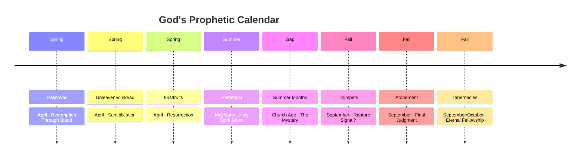
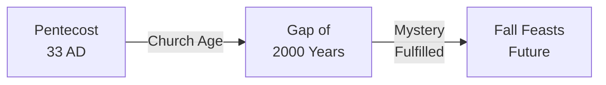
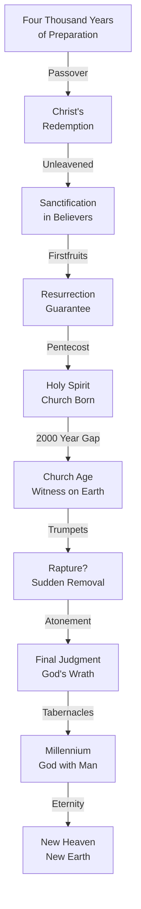

# Feasts of Israel and Prophecy

The seven feasts of Israel are not merely historical celebrations—they are profound prophetic shadows of God's redemptive plan and the end times. Understanding their fulfillment gives us insight into God's timing and purposes.

## The Feast Calendar

The feasts fall into two groups: spring feasts (already fulfilled in Christ's first coming) and fall feasts (pointing to his return and the end times).

## Spring Feasts: Already Fulfilled

### Passover (Pesach) - Redemption

**Old Testament:** Exodus 12 - The blood of the lamb protects from judgment

**New Testament Fulfillment:** 1 Corinthians 5:7 - "Christ, our Passover lamb, has been sacrificed"

Jesus died on Passover, shedding His blood for our redemption. The lamb's blood on the doorpost foreshadowed the blood of Jesus applied through faith.

> "For as much as ye know that ye were not redeemed with corruptible things, as silver and gold... But with the precious blood of Christ, as of a lamb without blemish and without spot" (1 Peter 1:18-19 KJV)

### Feast of Unleavened Bread (Chag HaMatzot) - Sanctification

**Old Testament:** Exodus 12:15-20 - Remove all leaven for seven days

**New Testament Fulfillment:** 1 Corinthians 5:8 - "Therefore let us keep the Feast, not with old leaven, nor with the leaven of malice and wickedness, but with the unleavened bread of sincerity and truth"

Leaven represents sin. As the Israelites ate unleavened bread, believers are called to remove sin and live sanctified lives in the aftermath of redemption.

### Feast of Firstfruits (Bikurim) - Resurrection

**Old Testament:** Leviticus 23:9-14 - Bring the first sheaf of the harvest

**New Testament Fulfillment:** 1 Corinthians 15:20-23 - "But Christ has been raised from the dead, the firstfruits of those who have fallen asleep"

Jesus rose from the dead on Firstfruits (the Sunday after Passover), and His resurrection guarantees ours.

### Pentecost (Shavuot) - Holy Spirit

**Old Testament:** Leviticus 23:15-21 - Fifty days after Firstfruits; celebration of the harvest

**New Testament Fulfillment:** Acts 2 - The Holy Spirit given to believers

Exactly fifty days after Christ's resurrection, the Holy Spirit was given at Pentecost, birthing the Church and empowering believers.

## The Gap: Church Age

Notice the significant gap between the spring and fall feasts. Historically, approximately 2,000 years passed between Pentecost and now. Many theologians believe this gap represents the Church Age—the mystery period between Christ's ascension and His return.

> "Now I declare to you, brothers and sisters, that flesh and blood cannot inherit the kingdom of God, nor does the perishable inherit the imperishable... Listen, I tell you a mystery: We will not all sleep, but we will all be changed" (1 Corinthians 15:50-51 NIV)

## Fall Feasts: Future Fulfillment

The fall feasts have not yet been fulfilled and are widely understood as prophecies of end-times events.

### Feast of Trumpets (Rosh Hashanah) - Rapture?

**Old Testament:** Leviticus 23:23-25 - A solemn assembly with trumpet blasts

**Prophetic Connection:** Many scholars connect this to the rapture of the Church.

> "For the Lord himself will come down from heaven, with a loud command, with the voice of the archangel and with the trumpet call of God, and the dead in Christ will rise first. After that, we who are still alive and are left will be caught up together with them in the clouds to meet the Lord in the air" (1 Thessalonians 4:16-17 NIV)

The timing (fall), the trumpet, and the sudden gathering align with rapture theology.

### Day of Atonement (Yom Kippur) - Final Judgment

**Old Testament:** Leviticus 23:26-32 - The holiest day, covering sins for a year

**Prophetic Connection:** The final judgment and Christ's atonement completing at His return

This feast speaks of complete, final atonement—when all sin is judged and cleansed forever.

### Feast of Tabernacles (Sukkot) - Millennium

**Old Testament:** Leviticus 23:33-44 - Dwell in booths for seven days, commemorating the wilderness wandering

**Prophetic Connection:** The 1,000-year Millennium when God dwells with His people

> "And I heard a loud voice from the throne saying, 'Now the dwelling of God is with men, and he will dwell with them. They will be his people, and God himself will be with them and be their God'" (Revelation 21:3 NIV)

## The Prophetic Pattern

## Theological Implications

1. **God's Sovereignty:** The feasts reveal God's complete plan from creation to eternity
2. **Prophetic Precision:** Christ fulfilled the spring feasts with exact timing
3. **Future Certainty:** If spring feasts were precisely fulfilled, fall feasts will be too
4. **Believer Preparation:** Understanding this pattern should motivate holy living and watchfulness

## Questions for Reflection

- How does the precision of the spring feasts being fulfilled give you confidence about the fall feasts?
- What does it mean that the Church Age exists during the "gap" between Pentecost and Trumpets?
- How should understanding the feasts change how you live today?

## Key Passages

- **Leviticus 23** - The complete feasts calendar
- **1 Corinthians 5:6-8** - Spring feasts fulfilled
- **Colossians 2:16-17** - Feasts as shadows of reality
- **1 Thessalonians 4:15-17** - Rapture and trumpets
- **Revelation 20:1-10** - Millennium reign

---

*"These are the feasts of the Lord, the sacred assemblies you are to proclaim at their appointed times" (Leviticus 23:4)*
