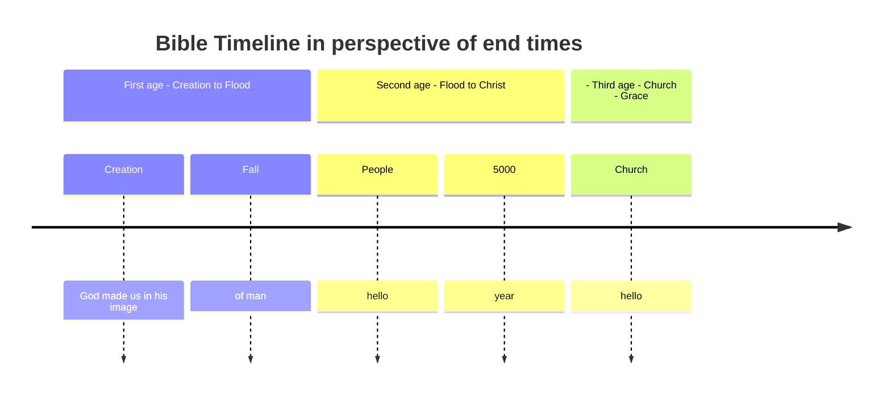
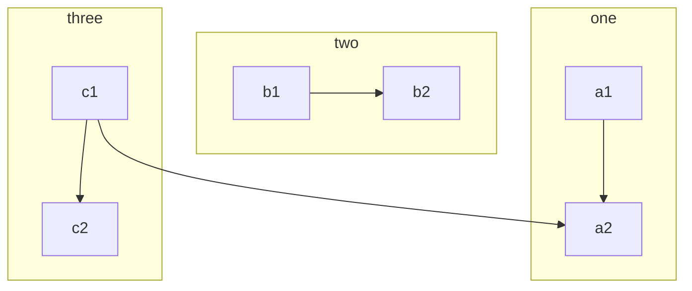
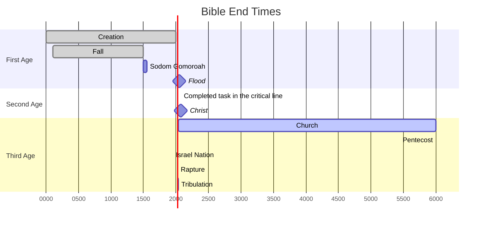

---
tags:
    - studies
    - end times
    - prophecy
---

# Charting end times

!!! note  "Under construction

    Apologies, this page is still under construction

## Resources

- [Larkin](https://www.blueletterbible.org/images/larkin/)

## Principals

Bible verses as basis
Title
Description 
linked to

Event - prophetic relationship

creation
fall
noah flood
lot
salvation
church
rapture
tribulation
millenial

