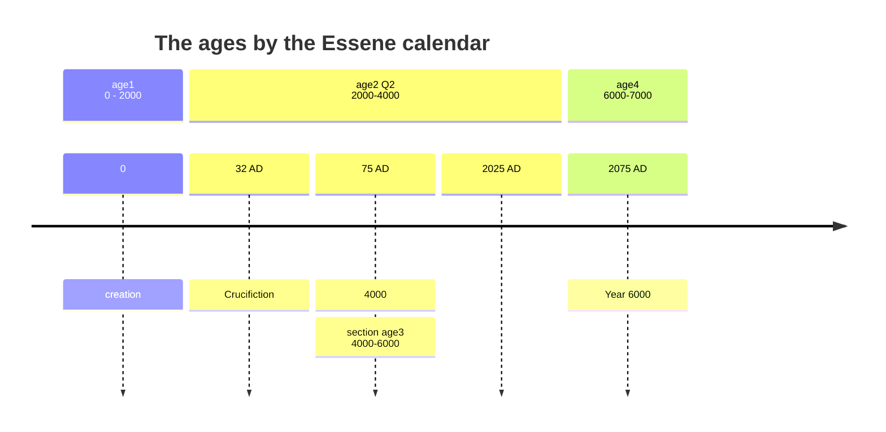

---
tags:
    - end times
    - prophecy
---

# The day is near

> ✝️ [Rev 1:3 (ESV)](https://www.blueletterbible.org/esv/Rev/1/3)
>
> Blessed is the one who reads aloud the words of this prophecy, and blessed are those who hear, and who keep what is written in it, for the time is near.

How is one to understand the time is near?

## Be patient

> ✝️ [Jas 5:7 (ESV)](https://www.blueletterbible.org/esv/Jas/5/7)
>
> [Jas 5:7 ESV] 7 Be patient, therefore, brothers, until the coming of the Lord. See how the farmer waits for the precious fruit of the earth, being patient about it, until it receives the early and the late rains.

In all of this - remember it is by His time and Good will. You are called to be patient.

## The time is a mystery

> ✝️ [Mar 13:32-37 (ESV)](https://www.blueletterbible.org/esv/Mar/13/32-37)
>
> 32 "But concerning that day or that hour, no one knows, not even the angels in heaven, nor the Son, but only the Father. 33 Be on guard, keep awake. For you do not know when the time will come. 
>
> 34 It is like a man going on a journey, when he leaves home and puts his servants in charge, each with his work, and commands the doorkeeper to stay awake. 35 Therefore stay awake--for you do not know when the master of the house will come, in the evening, or at midnight, or when the rooster crows, or in the morning-- 36 lest he come suddenly and find you asleep. 
>
> 37 And what I say to you I say to all: Stay awake."

Refers to second coming not rapture. But the mystery is that people as in the days of Noah, did not accept the truth.

## A day like a thousand years

> ✝️ [2Peter 3:2-8 (ESV)](https://www.blueletterbible.org/esv/2Peter/3/2-8)
>
> [2Pe 3:2-8 ESV] 2 that you should remember the predictions of the holy prophets and the commandment of the Lord and Savior through your apostles, 3 knowing this first of all, that scoffers will come in the last days with scoffing, following their own sinful desires. 4 They will say, "Where is the promise of his coming? For ever since the fathers fell asleep, all things are continuing as they were from the beginning of creation." 
>
> 5 For they deliberately overlook this fact, that the heavens existed long ago, and the earth was formed out of water and through water by the word of God, 6 and that by means of these the world that then existed was deluged with water and perished. 7 But by the same word the heavens and earth that now exist are stored up for fire, being kept until the day of judgment and destruction of the ungodly. 
>
> 8 But do not overlook this one fact, beloved, that with the Lord one day is as a thousand years, and a thousand years as one day.

The typical interpretation of verse 8 is that God is outside of human understanding of time. Although true, there is a greater 
context to this verse that must be considered. There is an immediate context of discussing both creation of the world, and destruction of the world.

## The world was made in six days, and on the seventh rest

Consider the creation of the world...

> ✝️ [Exo 20:11 (ESV)](https://www.blueletterbible.org/esv/Exo/20/11)
>
> For in six days the LORD made heaven and earth, the sea, and all that is in them, and rested on the seventh day. Therefore the LORD blessed the Sabbath day and made it holy.

## The sabbath is a foreshadowing

THe seventh day is not just a tradition, a holy day established at creation. It is a prophecy, a foreshadowing.

> ✝️ [Heb 4:1-13 (ESV)](https://www.blueletterbible.org/esv/Heb/4/1-13)
>
> [Heb 4:1-13 ESV] 
> 1 Therefore, while the promise of entering his rest still stands, let us fear lest any of you should seem to have failed to reach it. 
> 2 For good news came to us just as to them, but the message they heard did not benefit them, because they were not united by faith with those who listened. 
>
> 3 For we who have believed enter that rest, as he has said, "As I swore in my wrath, 'They shall not enter my rest,'" although his works were finished from the foundation of the world. 
> 4 For he has somewhere spoken of the seventh day in this way: "And God rested on the seventh day from all his works." 
> 5 And again in this passage he said, "They shall not enter my rest."
> 
> 6 Since therefore it remains for some to enter it, and those who formerly received the good news failed to enter because of disobedience, 7 again he appoints a certain day, "Today," saying through David so long afterward, in the words already quoted, "Today, if you hear his voice, do not harden your hearts." 
> 8 For if Joshua had given them rest, God would not have spoken of another day later on. 
>
> 9 So then, there remains a Sabbath rest for the people of God, 10 for whoever has entered God's rest has also rested from his works as God did from his. 
> 11 Let us therefore strive to enter that rest, so that no one may fall by the same sort of disobedience. 
> 12 For the word of God is living and active, sharper than any two-edged sword, piercing to the division of soul and of spirit, of joints and of marrow, and discerning the thoughts and intentions of the heart. 13 And no creature is hidden from his sight, but all are naked and exposed to the eyes of him to whom we must give account.

## The millenial reign

Can this millenial reign be tied to the Sabbath rest? They are certainly both related to the end times.

> ✝️ [Rev 20:2-7 (ESV)](https://www.blueletterbible.org/esv/Rev/20/2-7)
>
> [Rev 20:2-7 ESV] 2 And he seized the dragon, that ancient serpent, who is the devil and Satan, and bound him for a thousand years, 3 and threw him into the pit, and shut it and sealed it over him, so that he might not deceive the nations any longer, until the thousand years were ended. After that he must be released for a little while. 
>
> 4 Then I saw thrones, and seated on them were those to whom the authority to judge was committed. Also I saw the souls of those who had been beheaded for the testimony of Jesus and for the word of God, and those who had not worshiped the beast or its image and had not received its mark on their foreheads or their hands. They came to life and reigned with Christ for a thousand years. 
> 
> 5 The rest of the dead did not come to life until the thousand years were ended. This is the first resurrection. 6 Blessed and holy is the one who shares in the first resurrection! Over such the second death has no power, but they will be priests of God and of Christ, and they will reign with him for a thousand years. 7 And when the thousand years are ended, Satan will be released from his prison

## The six days as a foreshadowing

Prior to the seventh day is six days. We know so far:

1. God created in six days
1. On the seventh day God rested
1. The sabbath was made a holy day
1. The sabbath foresadows a greater sabbath rest of God
1. Christ will establish a millenial reign
1. A day is a thousand years

It is not unreasonable to interpret 2 Peter 3 as meaning a literal 6000 years of this creation, before the millenial reign.

## When is the year 6000?

By Essene calendar:

- [This site](https://www.fivedoves.com/letters/mar2024/luisv310-2.htm)
- [Josh Peck](https://www.youtube.com/watch?v=3b2XhHOA6Rc)

## Signs of the end of age

## In the same way

> ✝️ [Act 1:11 (ESV)](https://www.blueletterbible.org/esv/Act/1/11)
>
> [Act 1:11 ESV] 11 and said, "Men of Galilee, why do you stand looking into heaven? This Jesus, who was taken up from you into heaven, will come in the same way as you saw him go into heaven."

It is possible,the same way, also includes the same timing. 2032.