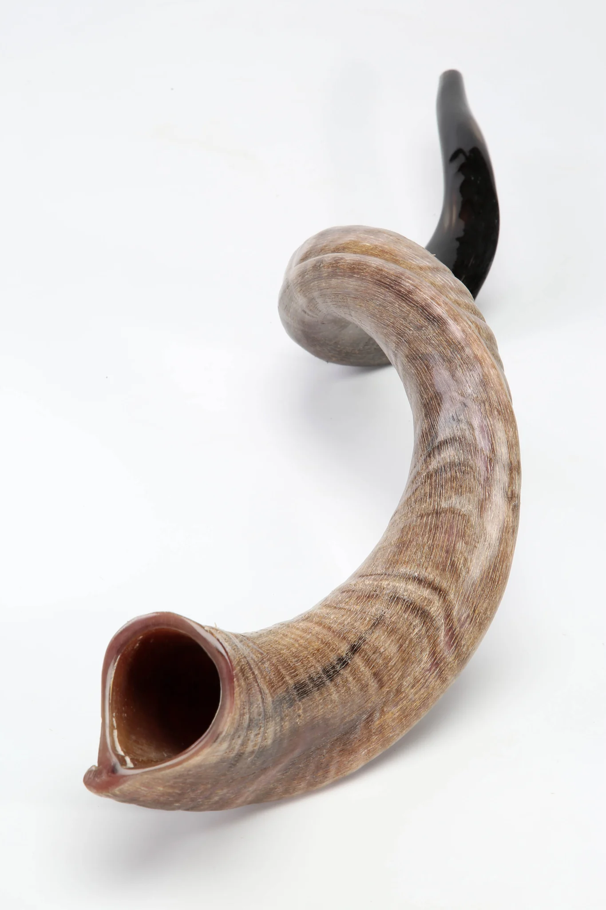

## Yom Teruah - Rosh Hashanah -  feast of trumpets

!!! abstract

    ✝️ [Lev 23:23-25 (ESV)](https://www.blueletterbible.org/esv/Lev/23/23-25)

    23 And the LORD spoke to Moses, saying, 24 "Speak to the people of Israel, saying, In the seventh month, on the first day of the month, you shall observe a day of solemn rest, a memorial proclaimed with blast of trumpets, a holy convocation. 25 You shall not do any ordinary work, and you shall present a food offering to the LORD."

## Day and hour not known

!!! quote

    "__Yom Teruah.: The Day of The Trumpet Blast__
    One of the seven Moedim of Yahweh (Divine Appointments or Feasts) is called the Yom Teruah. It is also referred to as Rosh Hashanah or the Feast of Trumpets. Of the seven moedim, this one is the only one that doesn’t have an exact starting time. This moed begins only when two witnesses see the edge of the moon and report their sighting to the Sanhedrin. This requirement introduces slight variable time to it’s inception. The Jews celebrate what is supposed to be the first day of the seventh month, Tishri, (Leviticus 23:23-25) over a two-day period because it is “the day no one knows the day or hour.” For this very reason, Yom Teruah was, and still is, referred to as “the moed that no one knows the day or hour of!”

    [source](https://www.faithwriters.com/article-details.php?id=206433)

## Two witnesses testify the start

Is this related to the two witnesses in Revelation?
When was the tradition of the two witnesses set?

---

[source](https://elshaddaisupplies.com.au/collections/shofars/products/plain-yemenite-horn-shofar?variant=37912383750338)

---

## References

- [A Hebrew Idiom](https://www.faithwriters.com/article-details.php?id=206433)
- [Hebrew4Christians](https://hebrew4christians.com/Holidays/Fall_Holidays/Rosh_Hashannah/rosh_hashannah.html)
- [Rapture and trumpets](https://robertcliftonrobinson.com/2015/09/10/why-the-rapture-is-called-no-man-knows-the-day-or-the-hour/)
- [For and against](https://hermeneutics.stackexchange.com/questions/29924/was-no-man-knows-the-day-or-the-hour-mt-2436-a-reference-to-rosh-hashanah)