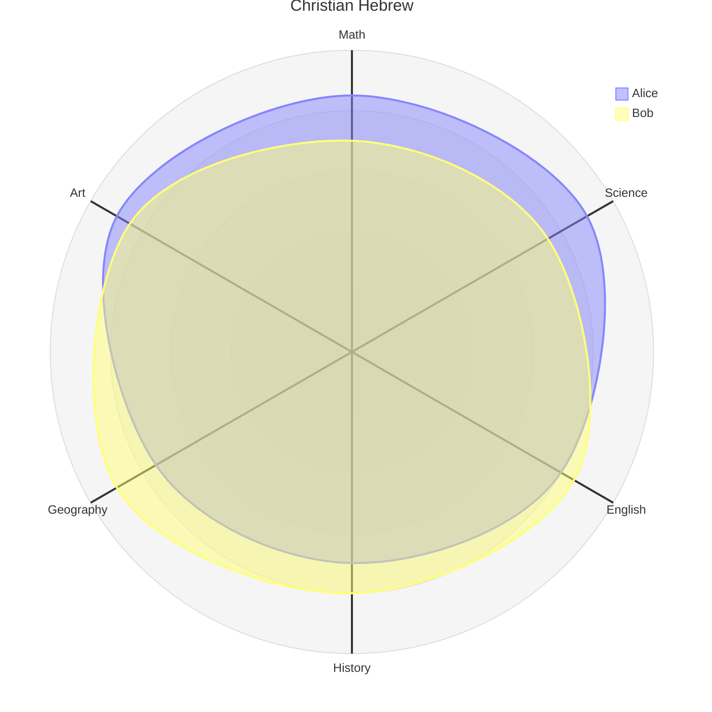

# Hebrew roots of Christianity

Christianity recognises Jesus Christ as the Messiah, fulfillment of Old Testament prophecy, Lord and saviour. This same Old Testament is the foundation of Judaism, and was treated by Jesus as scripture when he walked on earth as a man.

How important is it to understand the Hebrew roots of Christianity. Our Lord and his apostles did. 
So we should invest time in the study of key Hebrew perspectives of scripture.

## Key features

- Shadows and types
- Torah
- Festivals
- Creation
- Prophecy

## Festivals

The festivals alone are t 

## Diagram

## Resources

- [Seven festivals by Eddie Chumney](https://www.friendsofsabbath.org/Further_Research/Holy%20Days/The-Seven-Festivals-of-the-Messiah.pdf)
- [Hebrew Roots - Eddie Chumney](https://hebroots.org/)
- [Hebrew For Christians - John Parsons](https://hebrew4christians.com/#loaded)