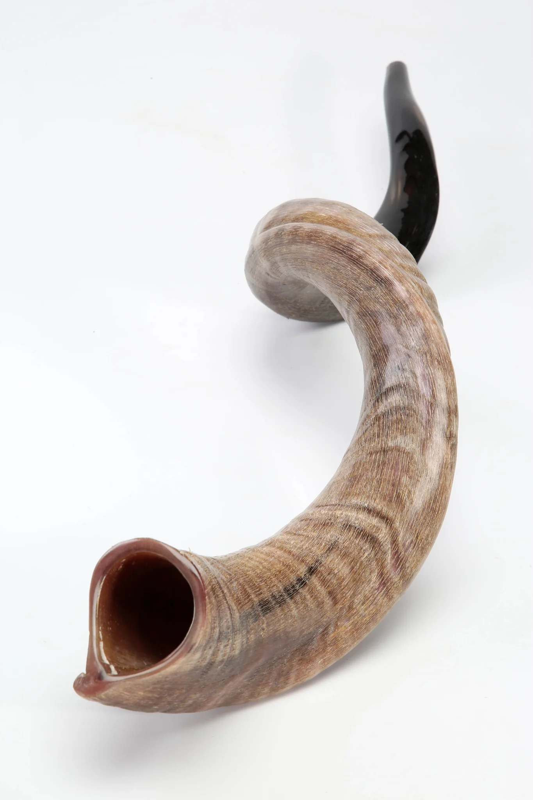
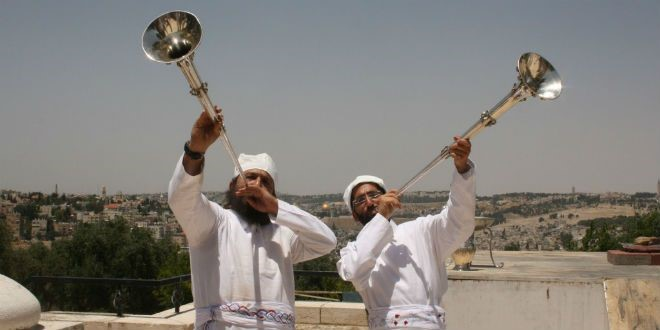

---
tags:
    - studies
    - end times
    - prophecy
---

# The trumpet call of God

The trumpet call is significant in the Bible. There are multiple references.
Are these references to the same trumpet call or are they different?

---

## Types of trumpets

### The shofar

- The most commonly used trumpet
- Made from a Goat horn

---

## What is the trumpet call

!!! info "Trumpets have special purpose"

    - communication and proclamation
    - to gather people
    - to announce the presence of God
    - a representation of authority and power
    - to start the movement of troops in war

---

## Shofar

---

## Silver trumpet

---

## Feast of Trumpets

---

## Seven trumpets

| | Trumpet | Purpose | Ref |
| --- | --- | --- | --- |
| :trumpet: | --- | --- | ✝️ [Rev 8:7 (ESV)](https://www.blueletterbible.org/esv/Rev/8/7) |
| :trumpet: | --- | --- | --- |
| :trumpet: | --- | --- | --- |
| :trumpet: | --- | --- | --- |
| :trumpet: | --- | --- | --- |
| :trumpet: | --- | --- | --- |
| :trumpet: | --- | --- | --- |

---

## The last trumpet

---

## The trumpet call

---

## Future studies

- Robes

---

## References

- 
- [ancient trumpets](https://bible-history.com/sketches/ancient-trumpets)
- [Jewish perspective](https://hoshanarabbah.org/blog/2019/06/21/the-two-silver-trumpets-and-the-two-houses-of-israel/)
- [Shofar in OT and NT](https://www.proshofar.com/religious-articles/Biblical%20Use%20of%20The%20Shofar%20Old%20Testament%20VS%20New%20Testament%20.html)
- [Shofar yementite](https://elshaddaisupplies.com.au/collections/shofars/products/plain-yemenite-horn-shofar?variant=37912383750338)