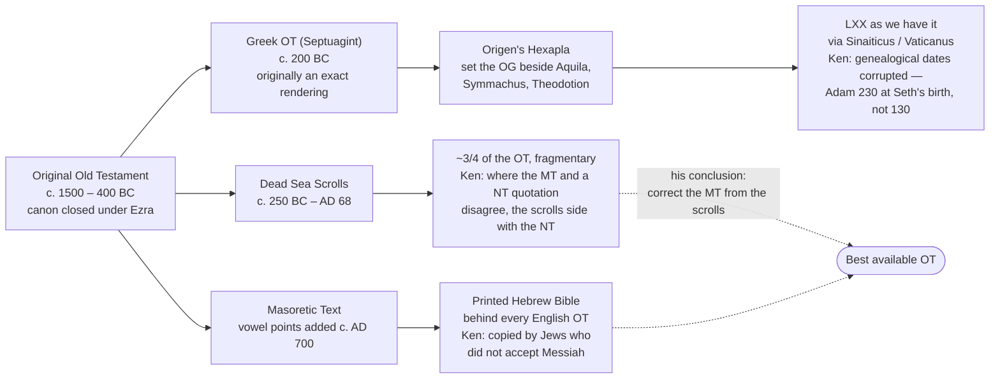
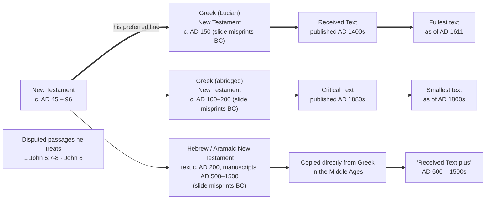

# Textual heritage: Ken Johnson's Old and New Testament transmission lines

**Source.** Ken Johnson (Bible Facts), *The Ancient Hebrew New Testament*, Monday night study,
<https://www.youtube.com/live/AN8EWx822pM>. Introductory session before a verse-by-verse study of
the Hebrew 1–2 Thessalonians. Transcript captured 2026-09-03; this file is a worked summary rather
than a raw dump, unlike the other files in this directory.

**Status.** Per [AGENTS.md](../../AGENTS.md), `references/biblefacts/` is raw, unvetted third-party
teaching — "a lead to chase down in a primary source, never as a citable reference in a study."
Several leads here *have* now been chased, and the results are recorded below. Nothing in this file
is citable as-is; the verified rows point at repo data or named primary sources that are.

---

## 1. The Old Testament line, as he presents it

**His argument.** The Masoretic Text is a thousand years younger than the scrolls and was copied by
scribes with a motive to smooth over messianic readings. Where a New Testament writer quotes the Old
Testament and the Masoretic disagrees, the Dead Sea Scrolls — two to three centuries BC — side with
the New Testament writer. His worked example is Hebrews 10:5, "a body you have prepared for me,"
against the Masoretic "ears you have dug for me."

**Verified here.** His Hebrews 10:5 example is exactly right, and checkable in `bible-text.db`:

| | reading |
|---|---|
| Hebrews 10:5 (SBLGNT) | Θυσίαν καὶ προσφορὰν οὐκ ἠθέλησας, σῶμα δὲ κατηρτίσω μοι |
| LXX Psalm 39:7 | *word-for-word identical* |
| MT Psalm 40:7 | אזנים כרית לי — "ears you have dug for me" |

But note what that case actually shows: the **Septuagint** accounts for the divergence on its own.
No scroll is needed. The cases where the scrolls genuinely arbitrate are different ones, and since
ingesting `restricted-data/dss` they can be checked here for the first time:

| Reference | Scrolls | Masoretic |
|---|---|---|
| Deuteronomy 32:8 | `dss-4Q37` בני אלוהים "sons of God" | בני ישראל "sons of Israel" |
| Psalm 22:17 (Eng. 22:16) | `dss-5/6hev1b` כארו | כארי "like a lion" |

**Where the claim is stronger than the evidence.** "The scrolls always agree with the New Testament
where the Masoretic differs" is not what the corpus shows. Qumran's biblical manuscripts are
textually plural: some align with the Masoretic, some with the Septuagint's Hebrew source, some with
the Samaritan tradition, some are independent. That plurality *is* the discovery. Our own ingest
also carries the caution he doesn't mention — 31.8% of the biblical words carry an editorial mark,
so a scroll reading inside brackets is a reconstruction, not evidence.

---

## 2. The New Testament line, as he presents it

Redrawn from his slide ([image](nt-heritage-diagram-kenjohnson.jpg)), using the dates he gives in the lesson.
His slide also runs a vertical *Middle Ages* band between the ancient and printed columns; that
is a layout device rather than a stage in transmission, so it is left out of the graph. The
double arrows mark the line he argues for.

**The slide misprints BC for AD in all three middle boxes.** His spoken dates are coherent and
the graph below uses them; see the claim table for the quotations. The distinction he draws for
the third line matters and the slide flattens it: the *manuscripts* are medieval (AD 500–1500),
while the *text* he argues is second-century, on the strength of patristic citation — "the text
is ancient, they're on manuscripts that are medieval."

**Published.** This three-line framing is now reproduced on
[Bible Translations & Source Texts](../../docs/content/scripture/translations.md), attributed to him
by name and with the two contested points below stated alongside it. That page is the vetted form;
this file remains the working notes.

**His argument.** Three lines descend from the original. The Received Text is the fullest; the
critical text is that text with material cut out by cults editing to fit their doctrine; and a third
line runs through Hebrew and Aramaic manuscripts. Most of that third line is medieval
back-translation from Greek made as a defence during the Inquisition — he concedes this freely — but
a small subset carries extra material that the back-translation theory cannot explain, because some
of it is *anti*-Catholic and would have made an inquisition worse, not better. Those same additions
appear in the same places across independent manuscript families (including the Cochin scrolls from
India), and are quoted by church fathers who predate every surviving manuscript. Hence "Received Text
**plus**" rather than a fourth text-type.

**What he explicitly does not claim.** He declines Hebrew primacy outright: *"we don't want to argue
that the Greek or the Hebrew or the Aramaic is the original."* He suggests Matthew and Paul may have
written in more than one language, so both could be originals, and he warns against the fallacy in
both directions — shorter is not automatically earlier, and longer is not either. The video's title
claims considerably more than the lesson does.

---

## 3. Claim-by-claim

| Claim | Assessment |
|---|---|
| Hebrews 10:5 follows the LXX against the MT | **Confirmed** in `bible-text.db`, word for word |
| Irenaeus attributes the 616 variant to scribal error | **Accurate** — *Against Heresies* 5.30.1 |
| Melito wrote under Marcus Aurelius, AD 160–180 | **Accurate** |
| Masoretes added vowel points c. AD 700 | **Accurate** |
| Most medieval Hebrew NT MSS are back-translations from Greek | **Accurate, and mainstream** — he agrees with the consensus here |
| Anti-Catholic readings can't be explained as anti-Inquisition inventions | **Sound in form.** A genuine falsification of the standard explanation for those specific readings, and the strongest part of his case |
| Patristic citation predates surviving manuscripts, so the reading is older | **Sound in form** — ordinary textual criticism |
| …therefore the father was quoting *the Hebrew* | **Weak link.** Victorinus wrote in Latin; "when the church shall have gone out of the midst" tracks the Greek ἐκ μέσου γένηται closely enough to need no Hebrew source. A shared reading dates the reading, not the language |
| Victorinus quoted c. AD 240 | **Off by ~60 years** — Victorinus of Pettau died c. 304 |
| Lucian compiled the NT canon in the second century | **Conflated.** Lucian of Antioch died in 312. The "Lucianic recension" is a real concept tied to the Byzantine text-type, its attribution is itself debated, and it concerns text-type rather than canon |
| Slide dates: Lucian ~150 BC, abridged ~100–200 BC, Hebrew ~200 BC | **A typo on the slide, not his position — it should read AD throughout.** He is explicit in the lesson: the New Testament was "written between 45 and 96 AD", Lucian assembled it "in the second century", and the Hebrew and Aramaic manuscripts are "medieval, 500 to 1500 AD". Those numbers are internally coherent; only the slide is wrong. Read the graph above with AD in all three boxes |
| Aquila, Symmachus and Theodotion were Gnostic / Hebrew Roots cults | **Wrong.** All three were Jewish or Jewish-Christian translators — Aquila a proselyte, Symmachus possibly Ebionite, Theodotion a proselyte. And the church adopted **Theodotion's Daniel**: it is the Daniel in our own `ebible-grcbrent`, and the form the New Testament generally quotes. A figure he classes as a cultist supplies the Daniel the church has used ever since |
| Jerome defended the Comma Johanneum in his prologue | **Attribution disputed.** The Prologue to the Canonical Epistles carrying that story is widely regarded as pseudonymous, probably 9th century, not Jerome's |
| A king ordered John 8 removed to protect his kingdom | **Right idea, wrong source.** **Augustine** (*De Adulterinis Coniugiis* 2.7) says some removed the passage fearing it licensed sin. That is a stronger citation than the anecdote |
| The Septuagint was a perfect translation by ~70 scholars | The **Letter of Aristeas** legend, generally read as apologetic rather than historical |
| The critical text is the Received Text with material cut out | **The contested question, stated as premise.** The mainstream reading is the reverse — that the Byzantine text is later and fuller. Neither side can be assumed |
| The scrolls always side with the NT against the MT | **Overstated** — Qumran is textually plural; that plurality is the finding |
| The Shapira scrolls may be genuine after all | **Live, minority.** Dershowitz revived the case in 2021; still rejected by most, but no longer dismissible on the grounds used in the 1880s |

---

## 4. On Salkinson-Ginsburg specifically

He argues the *original* Salkinson-Ginsburg carries readings in 1–2 Thessalonians that later editions
removed to conform it to the Received Text, and that a manuscript from around 1500 shows the same
phrase in the same place — so the compilers were not inventing.

We now hold that edition as `ebible-hebsg`. What our copy reads at 2 Thessalonians 2:6–7 is recorded
with a date in [references/README.md](../README.md), so a specific claim can be checked in one line
rather than re-derived. Two features of verse 7 stand out: it names an explicit personal restrainer
where Delitzsch is vague, and it closes מתוך המסילה, "out of the midst of the
highway" — and המסילה has no counterpart in the Greek, which reads only
ἐκ μέσου. That is a genuine plus. Whether it reflects an earlier Hebrew reading or a translator
supplying an idiom is open, and 2 Thessalonians 2:7 carries weight in the rapture study, so it needs
settling before it is cited.

---

## 5. Leads worth chasing

- **The Cochin manuscripts.** Traced: Ezekiel Raḥabi's Rabbinical-Hebrew Matthew, acquired by
  Claudius Buchanan in 1806 and given to Cambridge in 1809, digitised and publicly viewable.
  Eighteenth century, and Cambridge's own catalogue describes it as made for polemical purposes.
- **The specific Thessalonians readings**, when his study publishes them — a one-line check now.
- **Victorinus and Melito.** Both quotations need locating in their actual works before either is
  used. The Melito date is right; the Victorinus one is not.
- **His "~7 places" where the scrolls back a NT quotation against the MT.** Now testable against
  `dss-*`. Worth enumerating them properly rather than accepting the count.
